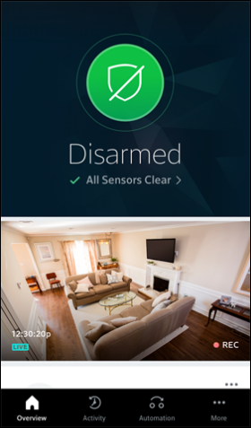

## Overview

During my time in Comcast, my team created home automation platform for Comcast Xfinity Home app, 
which let user schedule and executes automations over their IoT devices at home, such as lights, 
locks, cameras, alarms etc...

This is a actually complete workflow engine based on FSM (finite state machines) that's used 
internally by many development teams in Comcast to execute complex workflows.

Home automation is just one usecase supported by this platform.
